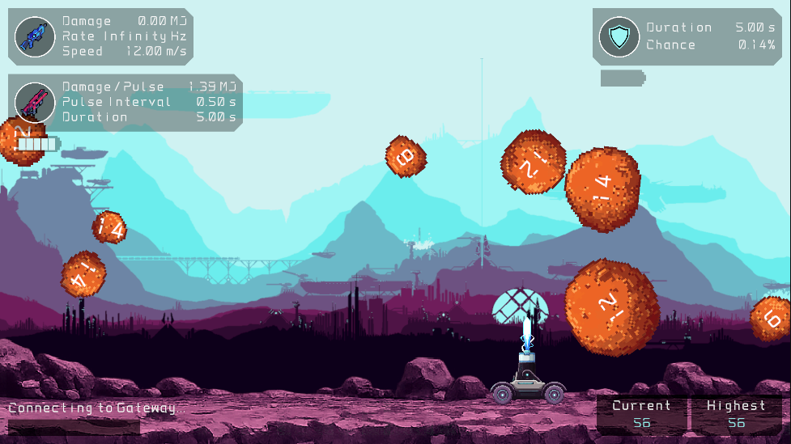
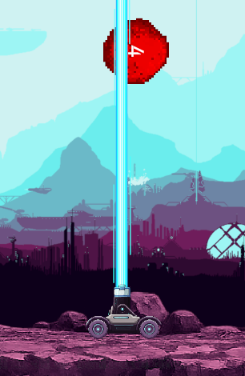
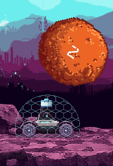

# Entropy

A 2D arcade survival shooter built in Unity. You pilot a turret on a mining outpost while rocks fall from orbit. Dodge them, blast them apart, and survive as long as you can. Between waves you pick upgrades for your blaster, laser, and shield.

Built for WebGL and playable on [itch.io](https://bitstachio.itch.io/entropy).



## Controls

| Input           | Action                               |
| --------------- | ------------------------------------ |
| `A` / `D`       | Move left / right                    |
| `Space`         | Fire laser (when battery is charged) |
| `1` / `2` / `3` | Pick an upgrade (or use the mouse)   |

The blaster fires automatically. The laser and shield have their own charge cycles; see the in-game Guide for details.

## Project layout

```
Assets/
├── Core/          Shared infrastructure (events, audio, upgrades, stat registry, services)
├── Features/      Gameplay and UI, organized by feature
├── Scenes/        MainScene, GameScene, GameOverScene
└── Scopes/        Scene-level VContainer lifetime scopes
```

`Core` holds code that any feature can depend on. `Features` holds everything specific to a slice of the game: player weapons, rocks, menus, progression, and so on. Features do not reference each other's internals.

## Architecture

### Feature folders with MVC

Each feature is a self-contained folder with a familiar split:

- **Model**: plain C# classes holding state and derived values (e.g. `BoltModel` reads damage from the stat registry).
- **View**: `MonoBehaviour` components that own transforms, colliders, animations, and UI bindings.
- **Controller**: plain C# classes that connect model and view, subscribe to input or physics callbacks, and publish events.

A feature often adds small **extensions** as child folders when the concern is separate but still owned by that feature. Blaster is a good example:

```
Features/Player/Attack/Blaster/
├── Blaster.cs              # weapon controller (auto-fire)
├── BoltModel.cs / BoltView.cs / BoltController.cs
├── BlasterScope.cs         # DI wiring for this feature
├── Sfx/                    # listens for BlasterShotEvent, plays audio
├── StatDisplay/            # HUD readouts for damage, fire rate, speed
└── Upgrade/                # upgrade definitions wired into the upgrade system
```

Laser, shield, and movement follow the same idea. Shared patterns (stat display controllers, SFX controllers) live in `Core` and are configured per feature.

### Event bus

Features are not allowed to reach into each other's modules. Cross-feature communication goes through a **statically typed event bus**: each event is a small struct in `Core/Events/Channels/`, and `EventChannel<T>` is registered once in DI as both `IEventPublisher<T>` and `IEventListener<T>`.

```csharp
// Publisher (inside a feature)
_blasterShotPublisher.Publish(new BlasterShotEvent());

// Listener (in another feature or Core extension)
_rockHitListener.OnPublished += HandleRockHit;
```

No stringly-typed messages, no global singleton accessors. Just inject the channel interface you need. Sfx, progression, orchestration, and pause all hook in this way without importing each other's namespaces.

### Dependency injection (VContainer)

[VContainer](https://github.com/hadashiA/VContainer) wires the project together.

- **Lifetime scopes**: `RootLifetimeScope` (persists across scenes), `GameLifetimeScope` (per run), and feature scopes like `BlasterScope` nest under scene hierarchies.
- **Installers**: `MonoBehaviour` components that register groups of services (audio, upgrades) into a scope's container.
- **Entry points**: controllers and services registered with `RegisterEntryPoint<T>()` get `Start`, `Tick`, and `Dispose` called by VContainer.

Most game logic is written as **POCOs** (plain C# objects) with constructor injection. That keeps dependencies explicit, makes classes easy to reason about, and avoids hiding wiring inside `MonoBehaviour` lifecycle methods.

The view layer is where Unity's inspector still matters: scopes and installers expose `[SerializeField]` references to views, configs, and prefabs. Those get passed into constructors via `WithParameter` or `RegisterComponent`. Unity handles presentation; VContainer handles composition.

### Stat registry and upgrades

Runtime stats (blaster damage, laser pulse interval, movement speed, etc.) live in generic `StatRegistry<TKey>` instances registered at the game scope. Baseline values are set when a feature scope builds; upgrades apply multipliers through the same registry and publish update events for the HUD.

## Scenes and flow

| Scene           | Role                                 |
| --------------- | ------------------------------------ |
| `MainScene`     | Main menu, guide, settings           |
| `GameScene`     | Full gameplay loop                   |
| `GameOverScene` | Score summary, retry, return to menu |

`Orchestrator` listens for a rock hitting the player and drives the transition to game over. `ProgressionController` tracks score from rock destruction events. Session data (high score, run stats) survives in `RootLifetimeScope` across scene loads.

## Screenshots

|                                 |                                   |
| ------------------------------- | --------------------------------- |
|  |  |
| Laser beam (charged battery)    | Shield active                     |

## Requirements

- Unity **6000.0.63f1** (Unity 6)
- Universal Render Pipeline (2D)

Open `Assets/Scenes/MainScene.unity` and press Play, or build to WebGL using the Entropy WebGL template under `Assets/WebGLTemplates/Entropy/`.

## License

Add your license here if you plan to open-source the repo.
